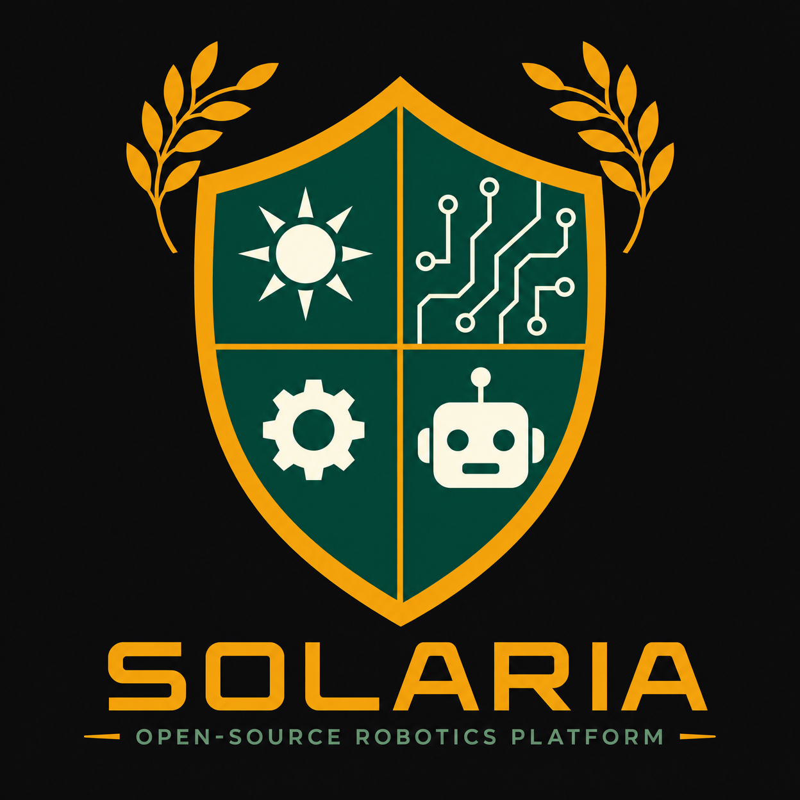

<p align="center">
  
</p>

# Solaria

**An open-source ecosystem of robotics extensions for visual programming platforms — same capabilities, every platform.**

Solaria defines the **Solaria Standard Protocol (SSP)** — a shared communication specification that connects supported programming environments (App Inventor, Scratch/TurboWarp, and more) to diverse robotics hardware. Each platform has its own purpose-built extension with blocks that feel native to that environment; SSP is what ensures the underlying robot capabilities — motor control, sensor reading, real-time feedback, and AI integration — are consistent across every supported combination.

[](LICENSE)

---

## Architecture

```text
┌─────────────────────────────────────────────────────────┐
│  Layer 3: AI / Agent (Future)                           │
│  Natural language → robot commands                      │
└───────────────────────────┬─────────────────────────────┘
                            │
┌───────────────────────────┴─────────────────────────────┐
│  Layer 2: Clients                                       │
│  App Inventor · Python · Web · Scratch™                 │
└───────────────────────────┬─────────────────────────────┘
                            │  ← SSP messages
┌───────────────────────────┴─────────────────────────────┐
│  Layer 1: Bridge Firmware                               │
│  Translates SSP → hardware-native commands              │
└───────────────────────────┬─────────────────────────────┘
                            │
┌───────────────────────────┴─────────────────────────────┐
│  Layer 0: Hardware                                      │
│  LEGO SPIKE · micro:bit™ · OpenCat · ESP32 · …          │
└─────────────────────────────────────────────────────────┘
```

**Hybrid architecture:** Solaria supports two types of hardware:

- **TYPE 1 (Open Firmware)** — devices you can flash with SSP firmware directly (ESP32, micro:bit™, StackChan, Raspberry Pi, CyberBrick, mBot2). Once firmware is built, ALL clients work automatically.
- **TYPE 2 (Closed Firmware)** — devices with proprietary firmware (LEGO, Sony® toio™, UBTECH® uGot). A protocol translation library converts SSP ↔ proprietary commands, then each client needs a thin wrapper.

See [ARCHITECTURE.md](ARCHITECTURE.md) for the full explanation with data flow diagrams and cost implications.

**The client is where the program logic lives.** It runs on the student's device — smartphone, laptop, tablet, or browser — and has access to everything that device can do: camera, microphone, sensors, AI/ML libraries, internet connectivity. The **hub** is the physical robotics hardware: a motor controller, sensor array, microcontroller, or commercial robot. The hub executes commands and reports sensor state; it does not run student logic. Some hubs have limited onboard AI (face detection, speech recognition, object tracking); within Solaria, these are treated as additional sensor inputs — the client remains the decision-maker.

Because the client orchestrates all logic, a single client instance can maintain connections to multiple hubs simultaneously, enabling multi-device coordination from one program.

**SSP (Solaria Standard Protocol)** is transport-agnostic — implementations may use Bluetooth Low Energy, WiFi, USB serial, infrared, or any other byte-stream transport appropriate to the hardware.

---

## Supported Hardware

| Hardware Platform | Type | Transport | Status | Priority | Target Audience |
| :--- | :---: | :--- | :---: | :---: | :--- |
| LEGO® SPIKE™ Prime | Protocol Library | BLE | ✅ Shipped | Gen 1 | K-8 |
| Generic ESP32 "Solaria Firmware" | Firmware | BLE + WiFi | 📋 Planned | Gen 2a | All levels |
| BBC micro:bit™ | Firmware | BLE | 📋 Planned | Gen 2b | K-8 |
| StackChan (M5Stack) | Firmware | BLE + WiFi | 📋 Planned | Gen 2b | Maker / K-12 |
| LEGO Powered Up (LWP3 family) | Protocol Library | BLE | 💡 Proposed | Gen 2b | K-8 |
| Robosen K1 (Interstellar Scout) | Protocol Library | BLE | 📋 Planned | Gen 2b | K-12 |
| UBTech Alpha Mini | Protocol Library | WiFi | 📋 Planned | Gen 2b | K-12 |
| Bee-Bot / Blue-Bot | Protocol Library | BLE | 📋 Planned | Gen 2b | K-2 Foundational |
| CyberBrick | Firmware | BLE + WiFi + ESP-NOW | 💡 Proposed | Gen 2c | Maker / K-12 |
| Makeblock mBot2 (CyberPi) | Firmware | BLE + WiFi | 💡 Proposed | Gen 2c | K-8 |
| Raspberry Pi | Firmware | WiFi + BLE + Serial | 💡 Proposed | Gen 2c | K-12 to Higher Ed |
| Sony® toio™ | Protocol Library | BLE | 💡 Proposed | Gen 2c | K-6 |
| UBTECH® uGot | Protocol Library | BLE + WiFi | 💡 Proposed | Long-term | K-12 |
| NAO Robot (SoftBank) | Protocol Library | WiFi | 💡 Proposed | Gen 3 | Higher Ed (HRI) |
| TurtleBot (ROS) | Protocol Library | WiFi (ROS Bridge) | 💡 Proposed | Gen 3 | Higher Ed (Motion Planning) |

> **What's next?** The community decides. [Vote here →](#vote-for-the-next-integration)

---

## Client Platforms

| Client Environment | Language | Status | Notes |
| :--- | :--- | :---: | :--- |
| MIT App Inventor | Java | ✅ Supported | Via .aix extension |
| Scratch™ / TurboWarp | JavaScript | ✅ Supported | Unsandboxed TurboWarp extension via Web Bluetooth — no Scratch Link required. Works on physical SPIKE Prime hubs. |
| Python | Python | 📋 Planned | Via SDK/library |
| Web (JavaScript) | JavaScript | 💡 Proposed | Via Web Bluetooth SDK |
| MicroBlocks | MicroBlocks | 📋 Planned | Open source, block-based, on-device live coding |
| MakeCode® | TypeScript | 💡 Proposed | Open source, Microsoft ecosystem |
| Arduino IDE | C/C++ | 💡 Proposed | Library for advanced users and firmware developers |

> Solaria focuses on **open-source** client platforms to ensure the widest possible access without licensing barriers.

> Students can begin with simpler block-based environments and advance to more capable platforms as their skills grow. The underlying robot capabilities remain consistent across every Solaria client, so the same hardware works throughout the educational journey.

---

## Core Principles

**Capability parity, not code portability.** Student code looks different on each platform — Scratch is event-driven, App Inventor is stateful, Python is imperative. That's intentional: each platform has its own idioms and strengths. What remains consistent is the set of robot capabilities available: motor control, sensor reading, real-time feedback, and AI integration. Same capabilities, every platform.

**Open and extensible.** SSP is a published specification. Anyone can build a new client or a new hub firmware. The ecosystem grows through community contribution.

**Transport-agnostic.** SSP defines the message format and semantics, not the wire. Implementations choose the transport (BLE, WiFi, USB serial, infrared) appropriate to their hardware and use case.

---

## Quick Start

1. **Pick a bridge** — clone the bridge repo for your hardware (e.g., `solaria-appinventor-spike-prime`).
2. **Flash or run** — follow the bridge README to get SSP running on your device.
3. **Connect a client** — open your preferred environment (App Inventor, Python, etc.) and use the corresponding Solaria client library to send commands.

---

## Vote for the Next Integration

Solaria's roadmap is community-driven. We use **GitHub Discussions polls** to decide which hardware gets integrated next.

→ [Cast your vote in Discussions](https://github.com/edcheng1010/solaria-hub/discussions)  
→ [View the full Roadmap](ROADMAP.md)

You can also **sponsor a specific integration** to accelerate its development. See [FUNDING.md](FUNDING.md).

---

## Documentation

| Document | Description |
| :--- | :--- |
| [ROADMAP.md](ROADMAP.md) | Project generations (Gen 1–4) and community voting |
| [ARCHITECTURE.md](ARCHITECTURE.md) | Layer model and SSP overview |
| [spec/SSP-v0.8.md](spec/SSP-v0.8.md) | Full protocol specification (latest) |
| [CONTRIBUTING.md](CONTRIBUTING.md) | How to propose, build, and submit |
| [VISION.md](VISION.md) | Product vision and sustainability model |
| [FUNDING.md](FUNDING.md) | Sponsorship and "Sponsor a Bridge" |

---

## Vision

Solaria is built in generations.

**Gen 1 (Foundation)** proved the architecture end-to-end: a student opens MIT App Inventor, connects to a LEGO® SPIKE™ Prime hub over Bluetooth, and controls motors and reads sensors using SSP. The protocol works.

**Gen 2 (Ecosystem Expansion)** grows the matrix of supported hardware and software platforms. Each new platform gets its own purpose-built extension — blocks that feel native to that environment — while SSP ensures the robot capabilities remain consistent. A student learning on App Inventor and a student learning on Scratch are building the same conceptual skills, even though their code looks different.

**Gen 3 (AI Agent Layer)** is where the experience truly converges. When the natural language interface is complete, students will describe what they want their robot to do in plain language — "drive forward until you see something red, then stop and flash the lights." The AI agent translates that intent into SSP commands, and the same prompt works regardless of whether the student is using App Inventor, Scratch, Python, or a future platform we haven't built yet. Platform differences fade behind the interaction model.

**Gen 4 (Solaria Flagship Robot)** is a reference hardware design — a purpose-built robot that ships with SSP firmware pre-flashed and works out of the box with every Solaria client. The "iPhone of the ecosystem."

The near-term goal is honest and practical: pick the software your students know, pick the hardware your budget allows, and Solaria has a curriculum-ready extension that works. The long-term goal is a unified learning experience where the robot responds to what you mean, not just what you type.

---

## Contributing

We welcome contributions from hardware makers, app developers, educators, and students. See [CONTRIBUTING.md](CONTRIBUTING.md) for details on:

- Proposing a new hardware integration
- Building a bridge (firmware developers)
- Building a client extension (app developers)
- Improving documentation

---

## Sponsor

Solaria is an independent open-source project. Development is sustained by community support — hardware purchases, development time, and documentation all cost real resources.

→ [GitHub Sponsors](https://github.com/sponsors/edcheng1010)  
→ [Sponsor a Bridge](FUNDING.md#sponsor-a-bridge--client)

---

## License

Apache License 2.0 — see [LICENSE](LICENSE) for the full text.

Copyright © 2026 Edward Cheng. See [NOTICE](NOTICE) for attribution details.

---

**Trademark Notice:** LEGO® and SPIKE™ are trademarks of the LEGO Group. micro:bit™ is a trademark of the Micro:bit Educational Foundation. Scratch™ is a trademark of the MIT Media Lab. MakeCode® is a trademark of Microsoft Corporation. Other trademarks are property of their respective owners. This project is not affiliated with or endorsed by any trademark holder. See [NOTICE](./NOTICE) for details.
